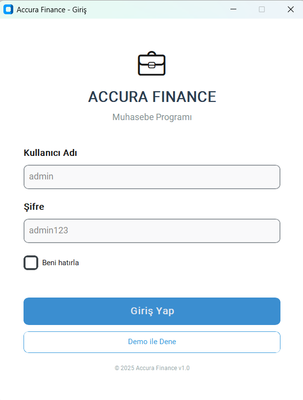
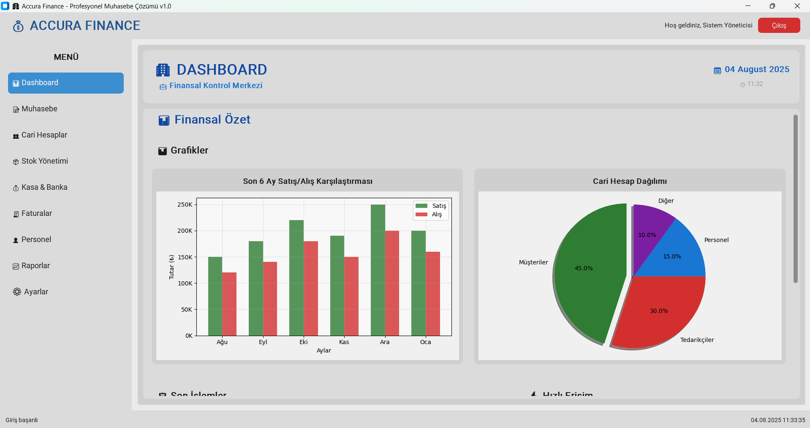

# 🏢 Accura Finance - Profesyonel Muhasebe Yazılımı


Modern, kullanıcı dostu ve tam kapsamlı muhasebe yazılımı. Küçük ve orta ölçekli işletmeler için tasarlanmış profesyonel finansal yönetim çözümü.

## 📸 Ekran Görüntüleri

### 🔐 Giriş Ekranı


### 📊 Ana Dashboard


## ✨ Özellikler

### 🎯 Ana Modüller
- **📊 Dashboard**: Finansal özet ve grafiklerde anlık görünüm
- **👥 Cari Hesaplar**: Müşteri/tedarikçi yönetimi ve borç-alacak takibi
- **💰 Kasa & Banka**: Nakit akışı yönetimi ve banka hareketleri
- **📝 Fatura Yönetimi**: Alış/satış faturaları ve e-fatura entegrasyonu
- **📦 Stok Yönetimi**: Envanter takibi ve stok hareketleri
- **📈 Raporlama**: Mali tablolar, mizan, gelir tablosu, bilanço
- **⚙️ Muhasebe**: Hesap planı, yevmiye, defteri kebir

### 🛠️ Teknik Özellikler
- **🖥️ Modern GUI**: CustomTkinter tabanlı responsive arayüz
- **🗄️ Güçlü Veritabanı**: Microsoft SQL Server entegrasyonu
- **📊 Grafik & Raporlama**: Matplotlib ile detaylı analizler
- **🔒 Güvenlik**: Kullanıcı authentication ve yetkilendirme
- **💾 Yedekleme**: Otomatik veri yedekleme sistemi
- **🌍 Dil Desteği**: Türkçe arayüz ve raporlar

## 🚀 Kurulum

### Gereksinimler
- Python 3.8 veya üzeri
- Microsoft SQL Server (LocalDB desteklenir)
- Windows 10/11

### 1. Projeyi İndirin
```bash
git clone https://github.com/ThecoderPinar/accura-finance.git
cd accura-finance
```

### 2. Sanal Ortam Oluşturun
```bash
python -m venv venv
venv\Scripts\activate  # Windows
```

### 3. Bağımlılıkları Yükleyin
```bash
pip install -r requirements.txt
```

### 4. Veritabanını Kurun
```bash
python setup_database.py
```

### 5. Uygulamayı Başlatın
```bash
python main.py
# veya
run.bat
```

## 🔑 Varsayılan Giriş Bilgileri
- **Kullanıcı Adı**: `admin`
- **Şifre**: `admin123`

## 📁 Proje Yapısı

```
accura-finance/
├── 📂 src/
│   ├── 📂 gui/              # Kullanıcı arayüzü modülleri
│   │   ├── 🔐 login_window.py
│   │   ├── 📊 dashboard.py
│   │   ├── 👥 customers.py
│   │   ├── 📝 accounting.py
│   │   ├── 📦 inventory.py
│   │   └── 📈 reports.py
│   ├── 📂 database/         # Veritabanı yönetimi
│   │   ├── 🔗 connection.py
│   │   ├── 📋 models.py
│   │   └── 📊 initial_data.sql
│   └── 📂 utils/           # Yardımcı araçlar
│       ├── ⚙️ config.py
│       └── 📝 logger.py
├── 📂 data/                # Veri dosyaları
├── 📂 docs/                # Dokümantasyon
├── 📄 requirements.txt     # Python bağımlılıkları
├── 🚀 main.py             # Ana uygulama dosyası
└── 📖 README.md           # Bu dosya
```

## 🎮 Kullanım

### Dashboard
- Finansal özetleri görüntüleyin
- Grafiklerde satış/alış trendlerini takip edin
- Hızlı erişim butonlarıyla işlem yapın

### Cari Hesaplar
- Müşteri ve tedarikçi kartları oluşturun
- Borç/alacak durumlarını takip edin
- Cari hesap ekstrelerini görüntüleyin

### Fatura Yönetimi
- Alış ve satış faturaları oluşturun
- KDV hesaplamalarını otomatik yapın
- Fatura yazdırma ve PDF çıktısı alın

### Muhasebe
- Hesap planını yönetin
- Yevmiye kayıtları yapın
- Mizan ve mali tabloları oluşturun

## 🔧 Geliştirme

### Katkıda Bulunma
1. Fork edin
2. Feature branch oluşturun (`git checkout -b feature/amazing-feature`)
3. Değişiklikleri commit edin (`git commit -m 'Add amazing feature'`)
4. Branch'i push edin (`git push origin feature/amazing-feature`)
5. Pull Request açın

### Test Etme
```bash
python -m pytest tests/
```

### Kod Formatı
```bash
black src/
flake8 src/
```

## 🗺️ Yol Haritası

### Version 1.0.1 (Geliştirmede)
- [ ] Tam işlevsel Cari Hesaplar modülü
- [ ] Fatura yönetimi sistemi
- [ ] Kasa & Banka işlemleri
- [ ] Gelişmiş raporlama

### Version 1.1.0 (Planlanan)
- [ ] E-fatura entegrasyonu
- [ ] Maaş bordrosu modülü
- [ ] İleri düzey analitik
- [ ] Mobile-responsive web arayüzü

## 📊 İstatistikler


## 📞 İletişim

**Geliştirici**: Pınar Topuz  
**Email**: [pinar@example.com](mailto:pinar@example.com)  
**LinkedIn**: [linkedin.com/in/pinar-topuz](https://linkedin.com/in/pinar-topuz)  
**GitHub**: [@ThecoderPinar](https://github.com/ThecoderPinar)

## 📄 Lisans

Bu proje MIT lisansı altında lisanslanmıştır. Detaylar için [LICENSE](LICENSE) dosyasına bakınız.

## 🙏 Teşekkürler

- [CustomTkinter](https://github.com/TomSchimansky/CustomTkinter) - Modern GUI framework
- [SQLAlchemy](https://sqlalchemy.org/) - Python SQL toolkit
- [Matplotlib](https://matplotlib.org/) - Python plotting library

---

⭐ **Bu projeyi beğendiyseniz yıldız vermeyi unutmayın!**


